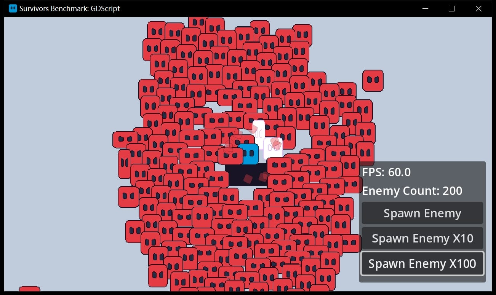

# Godot Survivors Benchmark

Executable file download: https://github.com/jerryshell/godot-survivors-benchmark/releases

- I wrote several survivors-like prototypes for performance comparison: GDScript, C#, Rust
- Player and enemies are CharacterBody2D, bullets are Area2D
- Logic code is NOT optimized (such as frame skipping, object pooling, multithreading, etc.)
- Auto-shoot uses brute force to search for the nearest enemy
- There are some basic particles and animations
- godot --version
  - 4.4.1.stable.mono.official.49a5bc7b6
- dotnet --version
  - 9.0.300
- rustc --version
  - rustc 1.87.0 (17067e9ac 2025-05-09)
- Hardware information
  - Intel Xeon E5-2667 v4 @ 3.20GHz
  - RAM DDR4 32.0GB
  - AMD Radeon RX590 GME
- All run in Release mode
- Number of enemies when performance drops (FPS below 50)
  - GDScript: ~250
  - C#: ~250
  - Rust: ~250
- Personal conclusion (very subjective)
  - If most of the game code is calling the Godot API, there is very little performance difference between them, whether it's GDScript, C#, or Rust
  - godot-rust/gdext is currently very cumbersome to use. If you are an independent developer and want to make a complete game and put it on Steam within a reasonable time limit, then I don’t recommend using Rust
  - Mixing multiple languages ​​in a project will increase complexity, and I don’t think it’s a good idea
  - As a programmer with many years of backend development background, I have a strong preference for strongly typed languages, so I will consider using C# in my next game
  - C# has a very obvious disadvantage: it cannot currently be exported to the Web, so if you want to participate in game jams, then GDScript is the best choice

